<p align="center">
  
</p>

# 🧬 DNA Data Storage ("Bio-Digital Memory") Interview Questions & Preparation Guide 💾

<p align="center">
  <a href="https://github.com/ishandutta2007/Awesome-Awesome-Awesome"></a>
  <a href="https://discord.gg/jc4xtF58Ve"></a>
  <a href="https://github.com/ishandutta2007"></a>
</p>

A curated, community-driven collection of interview questions 🧠 (with model answers 📝, frameworks 🏗️, and explanations 💡) for **DNA-based digital data storage roles** 🧬💾 — sometimes informally described as "bio-digital memory" 🔬 or "molecular data storage" 🧪 work. This comprehensive guide helps you prepare for roles spanning specialized DNA storage startups 🚀, cloud/hyperscaler research groups ☁️, and academic labs 🏫 building archival storage systems on synthetic DNA 🧪.

> 📝 **A note on the title:** "Bio-Digital Memory Architect" 👷‍♂️ isn't a standardized, widely-used job title in the industry today. This repo builds around the real, active technical field this title most plausibly points to — **DNA-based digital data storage** 🧬💾, i.e., encoding ✍️ and retrieving 🔍 digital information using synthetic DNA as the storage medium. If your target role is something else entirely (e.g., brain-computer interfaces 🧠💻, neuromorphic computing 🤖), this repo won't be the right fit — let us know 📣 and we'll consider a separate one.

This is not a list of trivia ❌. Every question includes:
- 🎯 **Why interviewers ask it**
- 🛠️ **A model answer or framework**
- 🕵️ **Follow-up questions** interviewers commonly use to probe deeper

> 🌱 This is v1. Contributions, corrections, and new questions are very welcome — see [CONTRIBUTING.md](CONTRIBUTING.md).

> ⚠️ **Note on scope:** This is a small, young, and fast-moving field sitting at the intersection of information theory, molecular biology, and systems engineering. Cost figures, throughput numbers, and even which technical approaches are considered state-of-the-art change quickly — treat specific numbers in this repo as illustrative and verify against current literature before an interview. For adjacent domain content, see companion repos on **Synthetic Biology Designer**, **Computational Biologist**, and **ML Engineer (Biotech)** roles.

---

## 📚 Table of Contents

| # | Category | What it covers |
|---|----------|-----------------|
| 1 | [DNA Data Storage Fundamentals](questions/01-dna-data-storage-fundamentals.md) | Why DNA as a storage medium, density comparisons, the read/write paradigm |
| 2 | [Encoding Schemes & Error Correction](questions/02-encoding-schemes-and-error-correction.md) | Binary-to-nucleotide encoding, biological sequence constraints, error correction codes |
| 3 | [Synthesis, Sequencing & Read/Write Technology](questions/03-synthesis-sequencing-and-read-write-technology.md) | How data is physically written and read, technology tradeoffs |
| 4 | [Random Access & Retrieval Architecture](questions/04-random-access-and-retrieval-architecture.md) | Addressing schemes, PCR-based random access, indexing at scale |
| 5 | [System Architecture & Data Pipeline Design](questions/05-system-architecture-and-data-pipeline-design.md) | Integrating digital and wet-lab components into one working system |
| 6 | [Storage Stability & Longevity](questions/06-storage-stability-and-longevity.md) | Archival properties, degradation modes, environmental robustness |
| 7 | [Economics, Scalability & Alternatives](questions/07-economics-scalability-and-alternatives.md) | Cost curves, scaling bottlenecks, comparison to other storage media |
| 8 | [Behavioral & Case Studies](questions/08-behavioral-and-case-studies.md) | Cross-disciplinary collaboration, real-world engineering tradeoffs |

Also see: [resources.md](resources.md) for external reading, key papers, and communities.

---

## 🧭 How to Use This Repo

- 💻 **Coming from an information theory/computer science/storage-systems background?** Prioritize sections 2 and 6 first — you'll need to build fluency in the biological constraints 🦠 (GC content, homopolymers, synthesis/sequencing error profiles) that make DNA a very different storage medium from anything in conventional systems 💾.
- 🧬 **Coming from a molecular biology/genomics background?** Prioritize sections 2, 4, and 7 — the goal is building rigor in information-theoretic thinking 🧮 (error correction, coding rate, addressing schemes) layered on top of your existing biological fluency 🔬.
- ✍️ **Interviewing at a company focused on the write/synthesis side?** Focus heavily on section 3.
- ⚙️ **Interviewing at a company focused on system integration/commercialization?** Focus heavily on sections 5 and 7.
- 🏛️ **Interviewing for an archival/long-term-storage-focused role?** Focus heavily on section 6.

Each question is tagged with a rough difficulty and role-level indicator 🚥:
- 🟢 Junior/Entry-level · 🟡 Mid-level · 🔴 Senior/Principal

---

## 🗂 Repo Structure

```
bio-digital-memory-architect-interview-questions/
├── README.md                                              ← you are here
├── CONTRIBUTING.md
├── LICENSE
├── resources.md
└── questions/
    ├── 01-dna-data-storage-fundamentals.md
    ├── 02-encoding-schemes-and-error-correction.md
    ├── 03-synthesis-sequencing-and-read-write-technology.md
    ├── 04-random-access-and-retrieval-architecture.md
    ├── 05-system-architecture-and-data-pipeline-design.md
    ├── 06-storage-stability-and-longevity.md
    ├── 07-economics-scalability-and-alternatives.md
    └── 08-behavioral-and-case-studies.md
```

## 🤝 Contributing

PRs are the whole point of this repo. If you were asked a question in a real interview that isn't here, add it! See [CONTRIBUTING.md](CONTRIBUTING.md) for format guidelines.

## 📄 License

Content is available under [MIT License](LICENSE) — use it freely for your own prep, mock interviews, or hiring loops.

## ⭐ Support

If this helped you land an offer, consider starring the repo and adding the question that stumped you — it might help the next person.

##  Star History
<div align="center">
<a href="https://www.star-history.com/?repos=ishandutta2007%2FAwesome-Bio-Digital-Memory-Architect-Interview-Questions&type=date&legend=bottom-right">
<picture>
<source media="(prefers-color-scheme: dark)" srcset="https://api.star-history.com/chartrepos=ishandutta2007/Awesome-Bio-Digital-Memory-Architect-Interview-Questions&type=date&theme=dark&legend=bottom-right" />
<source media="(prefers-color-scheme: light)" srcset="https://api.star-history.com/chartrepos=ishandutta2007/Awesome-Bio-Digital-Memory-Architect-Interview-Questions&type=date&legend=bottom-right" />

</picture>
</a>
</div>
